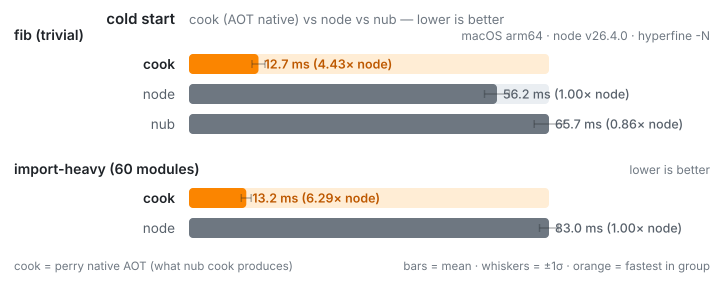

# `nub cook` — AOT-compiled native binaries (proof of concept)

`nub cook <script>` AOT-compiles a supported TypeScript/JavaScript script to a
native host executable via [PerryTS](https://github.com/PerryTS/perry), VERIFIES
it against nub-augmented Node, caches the verified binary, and runs it. The payoff
is **cold-start latency**: a native binary skips V8 warmup, the module graph, and
transpilation entirely. Run once to compile + verify; every run after is a cache
hit.

cook attempts the whole TypeScript family — `.ts`, `.mts` (ESM), `.cts` (CJS),
and `.tsx` — plus plain JavaScript. PerryTS's compiler handles all of them;
anything it can't handle falls back to Node (see below).

## Cold start: cook vs node vs nub

The three ways to start the same script: the cooked native binary, plain `node`,
and `nub` (transpile + Node — the normal `nub <file>` run path). Measured cold (a
fresh process per run) with `hyperfine --warmup 5 -N` (≥40 runs), on macOS arm64,
**Node v22.21.1**, perry 0.5.1206:



**Every number is RUN cost, never build cost.** The cooked native binary
(`perry compile`) is built **once, in setup, outside the timed loop** (the
"BUILD costs" block in [`bench.sh`](bench.sh)); hyperfine times only the runs that
follow. So cook's number is the **cooked binary's own startup at runtime** — the
compiled program booting and initializing its modules — **not** the `perry compile`
step.

**Both groups are SHORT, startup-dominated tasks. "Heavy" means a big IMPORT
GRAPH, not a longer-running program.** The compute in both `fib` and `heavy` is
deliberately tiny; the only axis that changes between them is *how much code there
is to load and enumerate*. `heavy`'s argument is kept small on purpose — Node's
`heavy` time is flat from `HN=1` to `HN≈1000`, so the ~75 ms is the cost of
parsing, compiling, and instantiating 60 modules at startup, **not** the loop.

### Trivial script

[`fib.ts`](fib.ts) — first 30 Fibonacci numbers, no imports, startup-dominated:

| approach | cold start | vs node |
| --- | --- | --- |
| cook | 12.2 ms ± 1.1 | **3.64× faster** |
| nub | 43.3 ms ± 1.6 | 1.03× (≈ node) |
| node | 44.5 ms ± 1.6 | — |

There is almost no code to load — the cost is the V8/Node process boot itself, and
only cook eliminates that. cook starts in ~12 ms; `nub` tracks plain Node within
noise here because the script transpiles trivially (a loader's cost shows up on
heavier transpile work, not on this fixture).

### Import-heavy script

[`heavy/heavy.mts`](heavy/heavy.mts) — 480 functions across 60 ESM modules, behind
an `export *` barrel, enumerated with `Object.values`:

| approach | cold start | vs node |
| --- | --- | --- |
| cook | 12.7 ms ± 1.2 | **5.97× faster** |
| node | 76.0 ms ± 1.6 | — |

cook stays at its ~12 ms floor: module init is cheap (60 modules initialize in a
few ms), so removing the runtime wins on the import-heavy script too.

### A note on a prior regression

An earlier version of this benchmark showed cook **slower** than node on the heavy
script (~203 ms, 0.41× node) and attributed it to per-module init scaling with
module count. That attribution was wrong. Profiling for
[PerryTS/perry#5736](https://github.com/PerryTS/perry/issues/5736) showed module
init is near-free (~0.02 ms/module); the cost was `Object.values`/`Object.entries`
over the wide star-export barrel namespace, which was **O(modules²)** in PerryTS's
`own_key_present`. [PerryTS#5738](https://github.com/PerryTS/perry/pull/5738) made
that path O(1)-per-key on wide objects — on the issue's repro, K=240 dropped from
140 ms to 12 ms and the per-module slope went flat. With that fix (perry 0.5.1206),
the heavy fixture's enumeration is ~12.7 ms, so cook now leads node by ~6×.

The reproducer is [`bench.sh`](bench.sh) (`./examples/cook/bench.sh`), which builds
the cooked binary, checks all three approaches print identical output, runs the two
hyperfine groups, and regenerates the chart with [`make-chart.mjs`](make-chart.mjs).
The heavy fixture's 60 modules + barrel are generated by
[`heavy/gen-mods.mjs`](heavy/gen-mods.mjs).

## How it works

`nub cook script.ts [--debug]`:

1. **Cache key** = `sha256(source)` + the PerryTS version + the compile flags.
   The source content is the change detector — any edit changes the key, so a
   stale binary is never served and there's no watcher.
2. **Warm paths** (decided with no perry, no Node):
   - A cached **verified binary** for the key → materialize + exec it directly.
     This is the fast, Node-free path.
   - A recorded **`not-cook-safe` verdict** for the key → run on Node directly,
     without re-checking or re-compiling. (See "verify" below.)
3. **Cold path** (fresh source):
   1. `perry check --check-deps` → if the script uses an API/package PerryTS
      can't compile, nub prints the diagnostic and falls back to Node. The gate
      reads the summary's `compilation_guaranteed` field (codegen-aware) when
      present, falling back to `success` (a frontend-only parse/HIR/deps check)
      for an older perry that doesn't emit it. Gating on the stronger field
      trims false-positives before the compile step; verify-before-trust still
      backstops the decision. When `perry check` evaluates **zero files** — its
      file discovery doesn't glob every extension the compiler accepts, so an
      undiscovered one (`.mts`, `.cts`, `.tsx`, `.jsx`, `.js`) reports zero
      files — that is *indeterminate*, not a "no": nub proceeds to compile (which
      **does** handle those extensions) and lets verify-before-trust decide,
      rather than bailing to Node on a check that never looked at the file.
   2. `perry compile -o <tmp>` → asserts a clean exit; a non-clean compile falls
      back to Node.
   3. **Verify-before-trust** (the differential): nub runs the freshly compiled
      binary AND nub-augmented Node on the **same args**, and compares **stdout +
      exit code** (stderr is informational and not compared — AOT and Node
      warnings legitimately differ).
      - **Equivalent** → the binary is stored in the cache as **verified** and
        its output is used.
      - **Diverged** → nub **discards** the binary, records a `not-cook-safe`
        verdict for that source (so it isn't re-attempted until the source
        changes), prints what diverged, and runs on Node.

A divergence does **not** necessarily mean PerryTS miscompiled the script. The
verify step assumes deterministic output, so a correct-but-**nondeterministic**
script — one that prints `Date.now()`, `Math.random()`, a timestamp, a PID, or
relies on unordered iteration — will legitimately produce different bytes on the
two verify runs and be recorded `not-cook-safe`. nub frames that case as
"output differed (expected for nondeterministic scripts)" and does **not** show
the PerryTS issue link for it; the issue link is reserved for `perry check` /
`perry compile` failures, which are genuinely the compiler's. A future
`--no-verify` bless path covers trusting such scripts deliberately.

### What "verified" means (the verify-once / arg-domain boundary)

The cache key is `sha256(source) + perry_version + compile_flags` — **the argv
is not part of it**, and verify runs **once**, on the **first** invocation's
args/stdin. Every run after that is a warm cache hit: nub execs the cached
binary for **any** later argv/stdin **without re-verifying**. So "verified"
means **smoke-tested on one input — not proven equivalent across the input
domain**. A compiler bug that only manifests on an input the first run didn't
exercise would slip past the gate.

The natural future strengthening is to key the verdict **per arg-set** — verify
each distinct argv once and cache that verdict — which the verdict cache already
supports without a new mechanism.

### The verify oracle is nub-augmented Node, not plain Node

The reference nub diffs the cooked binary against is **nub-augmented** Node — the
same transpile + preload pipeline `nub <file>` uses, not a bare `node`. So the
equivalence cook checks is "the PerryTS binary behaves like **nub's** Node," not
"like **plain** Node." This is deliberate: nub's augmentation layer is part of
the runtime contract a cooked script is replacing, so it belongs in the oracle.

The cache is a Rust [`cacache`][cacache] store under nub's cache dir
(`~/.cache/nub/cook`). The cache read/write is pure Rust — **no Node, no JS**
in the cache path. **Only a verified binary is ever cached or executed** — nub
never trusts a freshly compiled binary on perry's word alone.

[cacache]: https://crates.io/crates/cacache

## Requirements

- [PerryTS](https://github.com/PerryTS/perry) on `PATH` (or `PERRY_BIN=/path/to/perry`).
- A working clang/LLVM toolchain (PerryTS links a native binary).

Without either, `nub cook` prints a clear note and runs on Node instead.

To reproduce the benchmark you also need [`hyperfine`](https://github.com/sharkdp/hyperfine),
a Node ≥ 22.18 (native `.mts` type-stripping), and `nub` on `PATH` (or set
`NUB_BIN`). [`make-chart.mjs`](make-chart.mjs) rasterizes the `.png` via
`rsvg-convert` or macOS `qlmanage` if present; the `.svg` is the source of truth
and renders on GitHub directly.

## Demo

### Supported script — compiled, verified, cached

```
$ nub cook fib.ts 10
0 1 1 2 3 5 8 13 21 34
```

The first run compiles, verifies against Node, and caches. Output is identical to
Node:

```
$ node fib.ts 10        # (via nub's normal run path)
0 1 1 2 3 5 8 13 21 34
```

Every subsequent run is a cache hit — it execs the verified binary directly, with
no perry and no Node involved.

### Unsupported script — graceful Node fallback

`unsupported.ts` uses `eval()`, which can't be AOT-compiled:

```
$ nub cook unsupported.ts
nub cook: unsupported.ts uses APIs PerryTS does not compile:
  [D002] eval() cannot be compiled to native code (unsupported.ts:5)
  This looks like a PerryTS gap — file an issue: https://github.com/PerryTS/perry/issues
  Running on Node instead.
the answer is 42
```

The script still runs — the AOT path is an optimization, never a gate. Pass
`--debug` to dump PerryTS's raw output instead of the concise cause.

## Caveats

- **The boundary is the supported surface, not the workload shape.** The gate on
  whether `nub cook` applies is **does PerryTS compile the script** — not whether
  the workload is startup-bound or compute-bound. The cold-path cost (the check,
  the LLVM compile, and the two verify runs) only amortizes from a **persistent
  warm cache**; an ephemeral environment (e.g. CI without a warm cache) pays the
  full cold cost on every run.
- **cook's win is workload-shaped.** It is largest on short, startup-dominated
  scripts where the V8/Node boot dominates. A compute-heavy or long-running script
  shifts the balance toward steady-state throughput, where the runtime-removal win
  matters less. Measure your own script.
- **First-run double-run (side-effect caveat).** Verify-before-trust runs the
  script **twice** on its first cook — once as the cooked binary and once on
  Node — to confirm they behave identically. cook is therefore intended for
  **pure / CLI / compute** scripts; running an effectful script (one that writes
  files, sends network requests, etc.) through `nub cook` for the first time
  will perform those side effects twice. A `--no-verify` / bless path for trusted
  effectful scripts is a future refinement, not this PoC. After the first
  (verified) run, the warm path execs the cached binary once, like any program.
- **Supported surface only.** PerryTS decides what compiles. Anything it rejects
  — or any binary whose behavior diverges from Node in the verify step — falls
  back to Node.
- **First run pays the compile + verify cost.** Both are amortized by the cache;
  the first cook of a script is slower than just running it on Node.
- **Depends on PerryTS + a native toolchain.** Both must be present; otherwise
  nub runs the script on Node.
- **Explicit opt-in.** `nub cook` is its own verb — `nub <file>` and `nub run`
  never AOT-compile. cook is how you deliberately "seal in" the fast start for
  a specific script.
